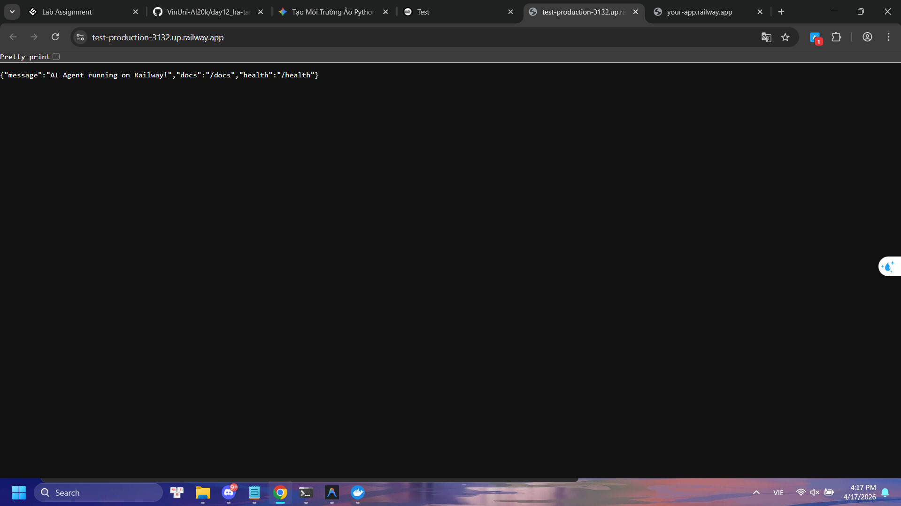
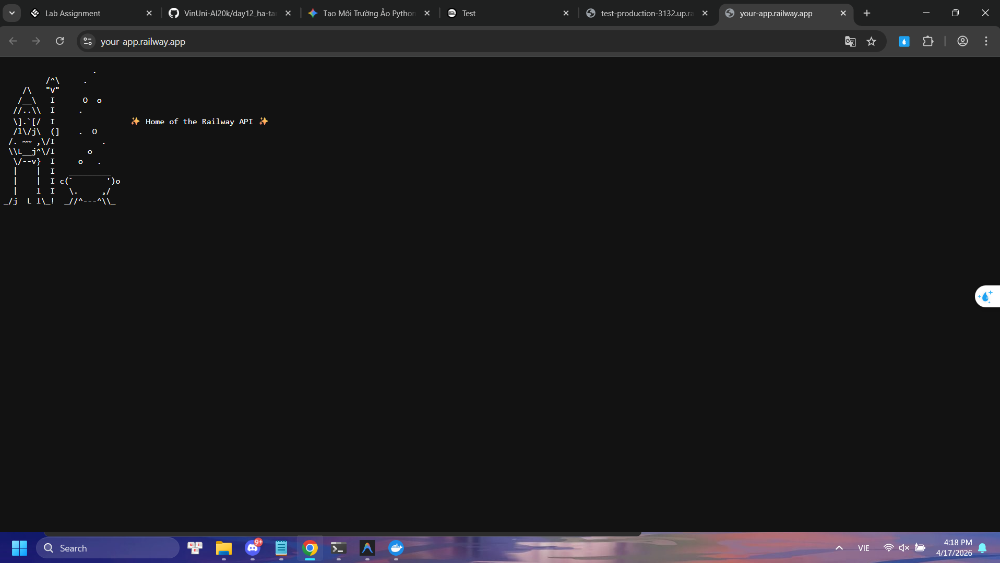

# Day 12 Lab - Mission Answers

## Part 1: Localhost vs Production

### Exercise 1.1: Anti-patterns found
1. **Hardcode secrets:** `OPENAI_API_KEY` và `DATABASE_URL` bị gán cứng trong code, nguy cơ lộ lọt bảo mật cao.
2. **Không có Config Management:** thiết lập cứng `DEBUG = True`, không dùng biến môi trường (.env).
3. **Logging sai cách:** Dùng `print()` thay vì logging chuyên dụng, ghi log lộ cả API Key ra console.
4. **Thiếu Health Check & Graceful Shutdown:** Không có API `/health` để giám sát trạng thái tự động restart, agent sẽ crash đột ngột khi xảy ra lỗi.
5. **Hardcode Port/Host & Hot Reload:** Chạy cố định ở Host `localhost` và Port `8000`, bật cờ `reload=True` chỉ dành cho Dev.

### Exercise 1.3: Comparison table
| Feature | Basic (Develop) | Advanced (Production) | Tại sao quan trọng? |
|---------|-----------------|-----------------------|---------------------|
| Config | Hardcode | Env vars | Giúp tái sử dụng code trên nhiều môi trường và bảo mật secrets. |
| Health check | Không có | `/health` & `/ready` | Để docker/cloud biết app còn sống không và tự điều hướng/restart. |
| Logging | `print()` | JSON logs | Chuẩn hóa cấu trúc để dễ dàng tích hợp và trace lỗi. |
| Shutdown | Đột ngột | Graceful | Cho phép in-flight requests hoàn thành nhằm bảo toàn dữ liệu. |

## Part 2: Docker

### Exercise 2.1: Dockerfile questions
1. Base image: `python:3.11`
2. Working directory: `/app`
3. Tại sao COPY requirements trước: Tận dụng Docker layer cache để tăng tốc build image (không phải install lại thư viện nếu chỉ sửa code).
4. CMD vs ENTRYPOINT: CMD có thể bị ghi đè tham số ở lệnh run, ENTRYPOINT cố định hành vi thực thi an toàn hơn.

### Exercise 2.3: Image size comparison
- Develop: 1.66 GB
- Production: 236 MB
- Difference: ~85%

## Part 3: Cloud Deployment

### Exercise 3.1: Railway deployment
- URL: https://test-production-3132.up.railway.app
  
- Screenshot:



## Part 4: API Security

### Exercise 4.1-4.3: Test results
**Exercise 4.1: API Key Auth Test Result:**
```bash
# Lệnh KHÔNG CÓ Key (Hiện thông báo lỗi)
$ curl.exe -X POST "http://localhost:8000/ask?question=Hello"
{"detail":"Missing API key. Include header: X-API-Key: <your-key>"}

# Lệnh CÓ Key (Trả về kết quả thành công)
$ curl.exe -X POST "http://localhost:8000/ask?question=Hello" -H "X-API-Key: demo-key-change-in-production"
{"question":"Hello","answer":"Đây là câu trả lời từ AI agent (mock). Trong production, đây sẽ là response từ OpenAI/Anthropic."}
```
**Exercise 4.2: JWT Auth Test Result:**
```bash
# Lấy Token cho teacher
$ curl.exe -X POST http://localhost:8000/auth/token -H "Content-Type: application/json" -d '{"username": "teacher", "password": "teach456"}'
{"access_token":"eyJ...","token_type":"bearer","expires_in_minutes":60,"hint":"Include in header: Authorization: Bearer eyJ..."}

# Dùng Token hợp lệ (Teacher)
$ curl.exe -X POST http://localhost:8000/ask -H "Authorization: Bearer <TOKEN_HERE>" -H "Content-Type: application/json" -d '{"question": "Explain JWT"}'
{"question":"Explain JWT","answer":"Agent đang hoạt động tốt! (mock response) Hỏi thêm câu hỏi đi nhé.","usage":{"requests_remaining":99,"budget_remaining_usd":1.6E-05}}

# Test không truyền JWT Token (sẽ bị lỗi 401)
$ curl.exe -X POST http://localhost:8000/ask -H "Content-Type: application/json" -d '{"question": "Test"}'
{"detail":"Authentication required. Include: Authorization: Bearer <token>"}

# Lấy Usage của bản thân
$ curl.exe -X GET http://localhost:8000/me/usage -H "Authorization: Bearer <TOKEN_HERE>"
{"user_id":"teacher","date":"2026-04-17","requests":1,"input_tokens":4,"output_tokens":26,"cost_usd":0.000016,"budget_usd":1.0,"budget_remaining_usd":0.999984,"budget_used_pct":0.0}
```

**Exercise 4.3: Rate Limiting Analysis & Test:**
- **Thuật toán sử dụng:** Sliding Window Counter
- **Hạn mức (Limit):**
  - Người dùng (User): 10 requests / 60 giây (1 phút)
  - Quản trị viên (Admin): 100 requests / 60 giây
- **Cách bypass hạn mức cho Admin:** Admin login (role="admin") sẽ được điều hướng tới proxy `rate_limiter_admin` với instance có init config `max_requests=100`, bỏ qua hạn mức mặc định 10 requests của user.

**Kết quả Test (Student):**
```bash
# Gửi liên tục 15 request đến API /ask (Với limit 10/phút)
Got token for student.
Request 1 - OK - Remaining: 9
Request 2 - OK - Remaining: 8
Request 3 - OK - Remaining: 7
Request 4 - OK - Remaining: 6
Request 5 - OK - Remaining: 5
Request 6 - OK - Remaining: 4
Request 7 - OK - Remaining: 3
Request 8 - OK - Remaining: 2
Request 9 - OK - Remaining: 1
Request 10 - OK - Remaining: 0
Request 11 - FAILED - Status: 429 - {"detail":{"error":"Rate limit exceeded","limit":10,"window_seconds":60,"retry_after_seconds":59}}
Request 12 - FAILED - Status: 429 - {"detail":{"error":"Rate limit exceeded","limit":10,"window_seconds":60,"retry_after_seconds":59}}
# ... Các request sau đều trả về 429 error Too Many Requests
```

### Exercise 4.4: Cost guard implementation
```python
import redis
from datetime import datetime

# Khởi tạo kết nối tới Redis phục vụ state lưu chi phí tập trung giữa các server
r = redis.Redis()

def check_budget(user_id: str, estimated_cost: float) -> bool:
    """
    Return True nếu còn budget, False nếu vượt.
    
    Logic:
    - Mỗi user có budget $10/tháng
    - Track spending trong Redis
    - Reset đầu tháng bằng thao tác TTL của Redis keys
    """
    # Sinh khoá tracking dựa trên tháng hiện tại (vd: "budget:student:2026-04")
    month_key = datetime.now().strftime("%Y-%m")
    key = f"budget:{user_id}:{month_key}"
    
    # Lấy chi phí trong tháng đã chạy từ Redis (hoặc bằng 0 nếu chưa có)
    current = float(r.get(key) or 0)
    
    # Kiểm tra hạn mức tiêu trong tháng vượt $10 hay ko
    if current + estimated_cost > 10:
        return False
    
    # Nếu chưa vượt, cộng dồn chi phí request hiện tại vào tổng chi của user đó
    r.incrbyfloat(key, estimated_cost)
    
    # Đặt thời gian hết hạn (TTL) của khoá là 32 ngày 
    # (Đủ bao trọn cho mọi tháng, tự động quét sạch hạn mức cũ khi sang tháng)
    r.expire(key, 32 * 24 * 3600)
    
    return True
```

## Part 5: Scaling & Reliability

### Exercise 5.1-5.5: Implementation notes
**Exercise 5.1: Health checks**

```python
from fastapi import FastAPI
from fastapi.responses import JSONResponse
import redis

app = FastAPI()
r = redis.Redis(host="localhost", port=6379)

@app.get("/health")
def health():
    """Liveness probe: Container/Process có đang sống không?"""
    return {"status": "ok"}

@app.get("/ready")
def ready():
    """Readiness probe: Đã có thể phục vụ request và DB có sống không?"""
    try:
        # Check Redis connection
        r.ping()
        # Nếu có DB (ví dụ Postgres):
        # db.execute("SELECT 1")
        return {"status": "ready"}
    except Exception as e:
        return JSONResponse(
            status_code=503,
            content={"status": "not ready", "error": str(e)}
        )
```

**Exercise 5.2: Graceful shutdown**
*Cài đặt Signal Handler bắt cờ SIGTERM để kết thúc an toàn:*
```python
import signal
import sys
import asyncio

def shutdown_handler(signum, frame):
    """Handle SIGTERM from container orchestrator"""
    print("\n[INFO] Nhận tín hiệu SIGTERM. Thực hiện Graceful Shutdown...")
    # 1. (Uvicorn chuẩn sẽ tự ngưng nhận request mới)
    # 2. Hoàn thành request hiện tại...
    # 3. Đóng kết nối DB, Redis
    try:
        r.close()
        print("[INFO] Đã đóng Redis connection an toàn")
    except NameError:
        pass
    # 4. Thoát process graceful
    sys.exit(0)

signal.signal(signal.SIGTERM, shutdown_handler)
```
*Quan sát:* Khi bị `kill -TERM`, request đang chạy dang dở (như model LLM sinh inference) vẫn được phục vụ xong xuôi, gửi HTTP 200 trả về Client rồi app mới thực sự đóng thay vì đứt kết nối ngầm.

**Exercise 5.3: Stateless design**
*Anti-pattern:* Cất trữ dữ liệu ngay trong RAM cấp ứng dụng (ví dụ bằng dictionary `conversation_history = {}`). Khi Container restart lại hoặc khi triển khai đa cụm qua Kubernetes/Docker, dữ liệu người dùng tại RAM của máy đó sẽ bị mất.
*Giải pháp:* Refactor đẩy state ra ngoài (Externalized State). Lưu log chat vào Redis `r.lrange(f"history:{user_id}", 0, -1)`. Dù API nằm ở Instance nào cũng sẽ chọc lấy dữ liệu từ một Datastore tập trung. Nhờ vậy app scale vô hạn mà không lo lệch state.

**Exercise 5.4: Load balancing**
- Nginx đảm nhiệm thiết lập Reverse Proxy giúp điều hướng traffic vào 3 instances `agent-1`, `agent-2`, `agent-3`.
- Khi dùng vòng lặp Bash bắn 10 lệnh curl, log của Docker Compose hiển thị log phân tán xen kẽ giữa các agent (ví dụ: request 1 vào agent-1, request 2 vào agent-2, request 3 vào agent-3) bằng cơ chế Round Robin. Nếu 1 instance sụp đổ, Nginx tự biết để tránh gửi vào máy đó.

**Exercise 5.5: Phục hồi sau sự cố chéo (Test stateless)**
- Bước 1: Khởi tạo ngữ cảnh qua instance ngẫu nhiên (ví dụ máy 1).
- Bước 2: Dùng lệnh kill tắt 1 process bất kỳ.
- Bước 3: Vẫn tiếp tục thực thi chat, 1 con instance khác nhận gánh mạng nhưng ngữ cảnh LLM vẫn được giữ mượt mà (bởi vì lịch sử chat nằm ở Redis Cluster). Điều này chứng minh 12-factor apps về Stateless Processes hoàn toàn đáng tin cậy.
